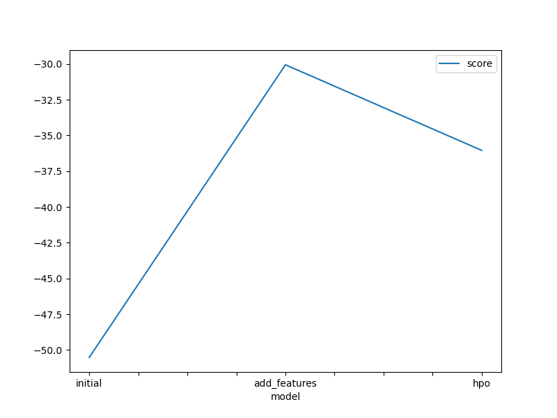
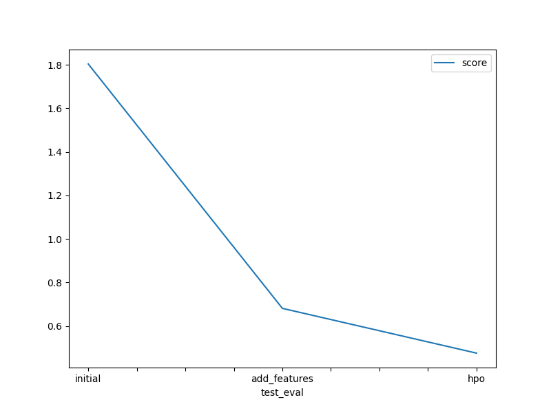

# Report: Predict Bike Sharing Demand with AutoGluon Solution
#### NAME HERE

## Initial Training
### What did you realize when you tried to submit your predictions? What changes were needed to the output of the predictor to submit your results?
I need to to count the number of negative values of predictions. As Kaggle only accepts the predictions that are greater than 0, I need to count these negative values in the predictions and set them to zero. Then I assign these predictions to the submission dataframe before submiting it to Kaggle.

### What was the top ranked model that performed?
The top rank model is `WeightedEnsemble_L3` trained by adding feature data and tuning hyperparameters.

## Exploratory data analysis and feature creation
### What did the exploratory analysis find and how did you add additional features?
1. I changed the datetime column with object `dtype` can be changed into `datetime` dtype.
2. I added more features by splitting data of year, month, day, hour and dayofweek from datetime column.
3. I plot the histogram of the training data to see the distributions of each feature in the data. There are categorical and continuous data. I converted season and weather data from `int64` into `categorical` type.

### How much better did your model preform after adding additional features and why do you think that is?
My model performed better after adding additional features. The RMSE fell from `1.80362` to `0.68146`. This observation proves that the additional features and categorized data help the model better learn the related patterns between the features and the target.

## Hyper parameter tuning
### How much better did your model preform after trying different hyper parameters?
Hyperparameter tuning significantly improved the model performance. The best RMSE score after trying different hyperparameters is `0.47593`.

### If you were given more time with this dataset, where do you think you would spend more time?
I would try to:
1. Explore more feature enginerring techniques on the data.
2. Tune more hyperparameters.
3. Train more algorithms such as Random Forest, KNN, XGBoost, and choose the best one.

### Create a table with the models you ran, the hyperparameters modified, and the kaggle score.
| model        | time_limit | presets      | num_epochs | num_boost_round | num_trials | num_folds | searcher | score   |
|--------------|------------|--------------|------------|-----------------|------------|-----------|----------|---------|
| inital       | 600        | best_quality | default    | default         | default    | default   | default  | 1.80362 |
| add_features | 600        | best_quality | default    | default         | default    | default   | default  | 0.68146 |
| hpo          | 600        | best_quality | 10         | 100             | 6          | 12        | random   | 0.47593 |

### Create a line plot showing the top model score for the three (or more) training runs during the project.

### Create a line plot showing the top kaggle score for the three (or more) prediction submissions during the project.

## Summary
In this project, I trained regression model with AutoGluon for predicting bike sharing demand. The Kaggle dataset provides the historical data of bike sharing data for training, testing and submission. 

After reading the dataframe, I trained the initial model. The RMSE score achieved was `1.80362`.

Next I did the EDA, added more feature columns from the datetime column and plotted the data distribution with histogram. The model performance after feature engineering was improved, having a RMSE scỏe of `0.68146`.

Finally, I did the hyperparameter tuning with AutoGluon. Trying with various combinations of hyperparameters led to an even better RMSE score of `0.47593`.