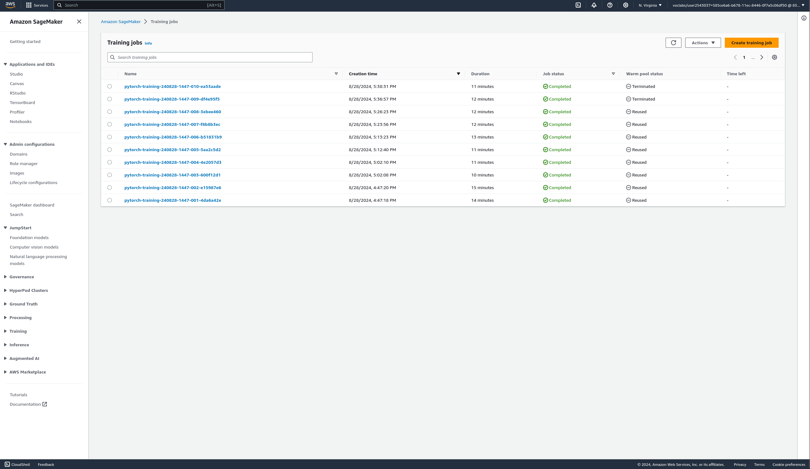
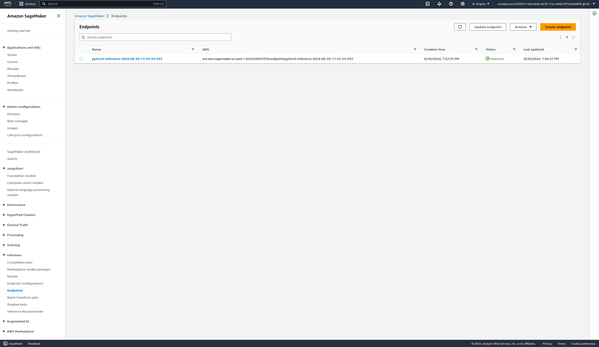

# Image Classification using AWS SageMaker

Use AWS Sagemaker to train a pretrained model that can perform image classification by using the Sagemaker profiling, debugger, hyperparameter tuning and other good ML engineering practices. This can be done on either the provided dog breed classication data set or one of your choice.

## Project Set Up and Installation
Enter AWS through the gateway in the course and open SageMaker Studio.  \
Download the starter files. \
Download/Make the dataset available. 

## Dataset
The provided dataset is the dogbreed classification dataset which can be found in the classroom.
The project is designed to be dataset independent so if there is a dataset that is more interesting or relevant to your work, you are welcome to use it to complete the project.

### Access
Upload the data to an S3 bucket through the AWS Gateway so that SageMaker has access to the data. 

## Hyperparameter Tuning
In this project, I use the ResNet50 model in the image classification task. I conduct hyperparameter search to find the optimal values for the learning rate and batch size. The learning rate range includes continuous values from `0.001` to `0.1`, while the batch size range is a categorical set of values among `16`, `32`, `64`, and `128`. Finally, I use the best learning rate and batch size value to train the model.


## Debugging and Profiling
### Debugging
I use the `smdebug` library to perform debugging in SageMaker. The library provides a set of hooks that can be used to capture the values of tensors at different points in the training process; and a set of rules that can be used to detect common issues in the training process. Debugging is used to check how well the model is training. \
I register the model by creating a SMDebug hook in the main function and passed this hook to the train and test functions with TRAIN and EVAL mode, respectively. I also configured the Debugger Rules and Hook Parameters of what should be tracked.

### Profiling
I use Sagemaker Profiler to monitor Instance metrics, GPU/CPU utilization and GPU/CPU memory utilization. I create profiler rules and configurations, then produce the output as a HTML report. 

### Results
After training the model for 10 epochs, it achieved an accuracy of about 95%. The profiler report shows that that the the model was underutilizing the GPU.


## Model Deployment
The deployed model is a Pytorch CNN model based on the ResNet50 model that has been finetuned for the Dog Breed Classification task. It has a linear fully connected output layer with output size 133 as there are 133 distinct dog breeds in the data provided.

To query the enpoint, get the endpoint using:
```python
predictor = sagemaker.predictor.Predictor('pytorch-inference-2024-08-28-17-52-53-033', 
                                           sagemaker_session=sagemaker_session)
```
To predict the label for an image:
```python
with open("image.jpg", "rb") as image:
  f = image.read()
  image_bytes = bytearray(f)
response = predictor.predict(image_bytes)
```