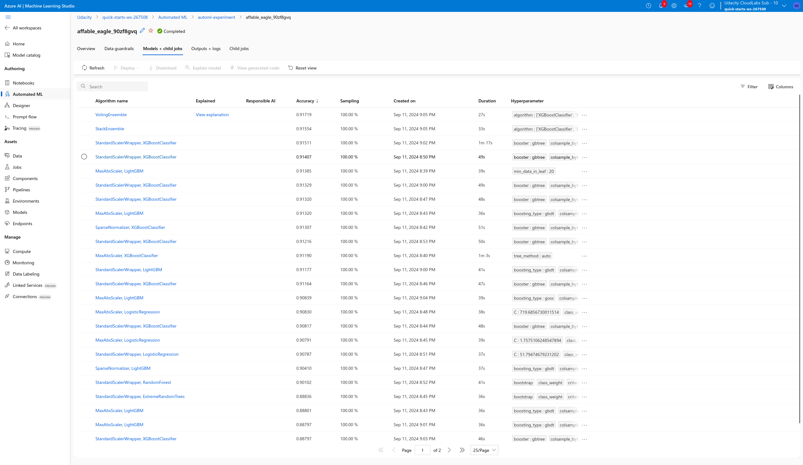

# Optimizing an ML Pipeline in Azure

## Overview
This project is part of the Udacity Azure ML Nanodegree.
In this project, we build and optimize an Azure ML pipeline using the Python SDK and a provided Scikit-learn model.
This model is then compared to an Azure AutoML run.

## Useful Resources
- [ScriptRunConfig Class](https://docs.microsoft.com/en-us/python/api/azureml-core/azureml.core.scriptrunconfig?view=azure-ml-py)
- [Configure and submit training runs](https://docs.microsoft.com/en-us/azure/machine-learning/how-to-set-up-training-targets)
- [HyperDriveConfig Class](https://docs.microsoft.com/en-us/python/api/azureml-train-core/azureml.train.hyperdrive.hyperdriveconfig?view=azure-ml-py)
- [How to tune hyperparamters](https://docs.microsoft.com/en-us/azure/machine-learning/how-to-tune-hyperparameters)

## Summary
**In 1-2 sentences, explain the problem statement: e.g "This dataset contains data about... we seek to predict..."** \
The dataset contains data about direct marketing campaigns (phone calls) of a Portuguese banking institution. This is a subset of the original public dataset available at UCI Machine Learning repository. We seek to predict if the client will subscribe to a bank term deposit.

**In 1-2 sentences, explain the solution: e.g. "The best performing model was a ..."**
Two approaches were used:
1. Apply a Scikit-learn Logistic Regression model, optimizing its hyperparameters using HyperDrive.
2. Use Azure Auto ML to build and optimize a model on the same dataset

The best model, considering accuracy as primary metric was the one obtained using AutoML. It was a Voting Ensemble model. However, the accuracy obtained both applying Logistic Regression with HyperDrive and AutoML were close, 0.9111 and 0.9172, respectively.

## Scikit-learn Pipeline
**Explain the pipeline architecture, including data, hyperparameter tuning, and classification algorithm.**
### `train.py`:
1. Loading dataset from https://automlsamplenotebookdata.blob.core.windows.net/automl-sample-notebook-data/bankmarketing_train.csv
2. Cleaning and transforming data
3. Calling the SKlearn Logistic Regression model

### `udacity-project.ipynb`:
1. Initialize our Workspace
2. Create an Experiment
3. Define resources, i.e., create AmlCompute as training compute resource. For this project we use a CPU cluster.
4. Submit the HyperDriveConfig to run the experiment using parameters defined in the previous step.
5. Use method  get_best_run_by_primary_metric() on the run to select the best hyperparameters for the Sklearn Logistic Regression model
6. Save the best model.

**What are the benefits of the parameter sampler you chose?** \
Random sampling supports discrete and continuous hyperparameters. It supports early termination of low-performance runs. In random sampling, hyperparameter values are randomly selected from the defined search space.

**What are the benefits of the early stopping policy you chose?** \
An early stopping policy automatically terminate poorly performing runs which improves computational efficiency. We used the Bandit Policy, which is based on slack factor/slack amount and evaluation interval. Bandit terminates runs where the primary metric is not within the specified slack factor/slack amount compared to the best performing run.

## AutoML
**In 1-2 sentences, describe the model and hyperparameters generated by AutoML.** \
Using the training part of the dataset, Azure AutoML tested different 28 models, tunning different hyperparameters for each of them, until the best of them (higher accuracy) was found. The best model produced by these parameters were a VotingEnsemble which achieved 0.9172 accuracy.

## Pipeline comparison
**Compare the two models and their performance. What are the differences in accuracy? In architecture? If there was a difference, why do you think there was one?** \
Both models (Logistic Regression (HyperDrive) and Voting Ensemble Classifier (AutoML)) obtained higher accuracy, respectively, 0.9111 and 0.9172. Logistic Regression is a simple model while Voting Ensemble Classifier is more complex.

AutoML had advantage over Logistic Regression with HyperDrive probably because it tried many different models and parameters. In addition, the chosen model is an ensemble model which means it unifies the best of different models.

## Future work
**What are some areas of improvement for future experiments? Why might these improvements help the model?** \
The data is imbalanced, as 11.2% the dataset is labeled yes and 88.8% is labeled no. Trying techniques to deal with imbalanced data before applying AutoML is something that I’d like to try in the future. In addition, I’d like to tune more AutoMLConfig parameters .

## Cluster clean up
Cluster was cleaned in the notebook.