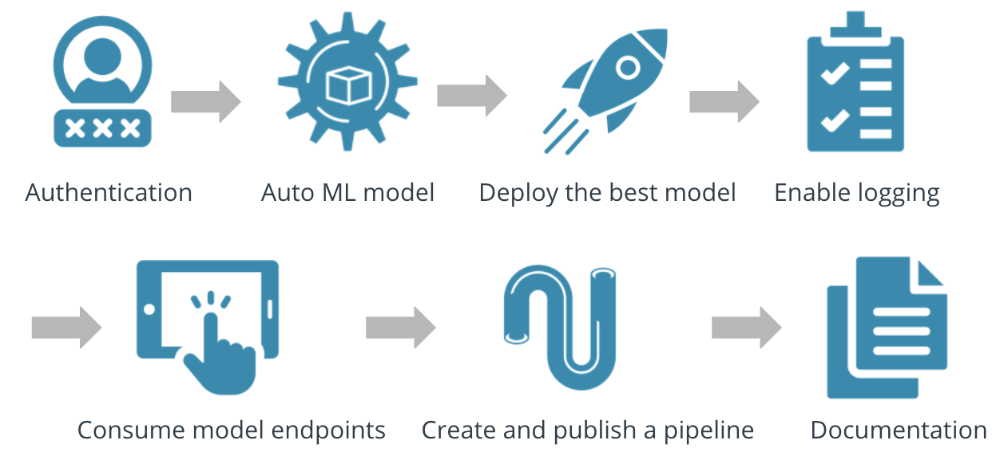
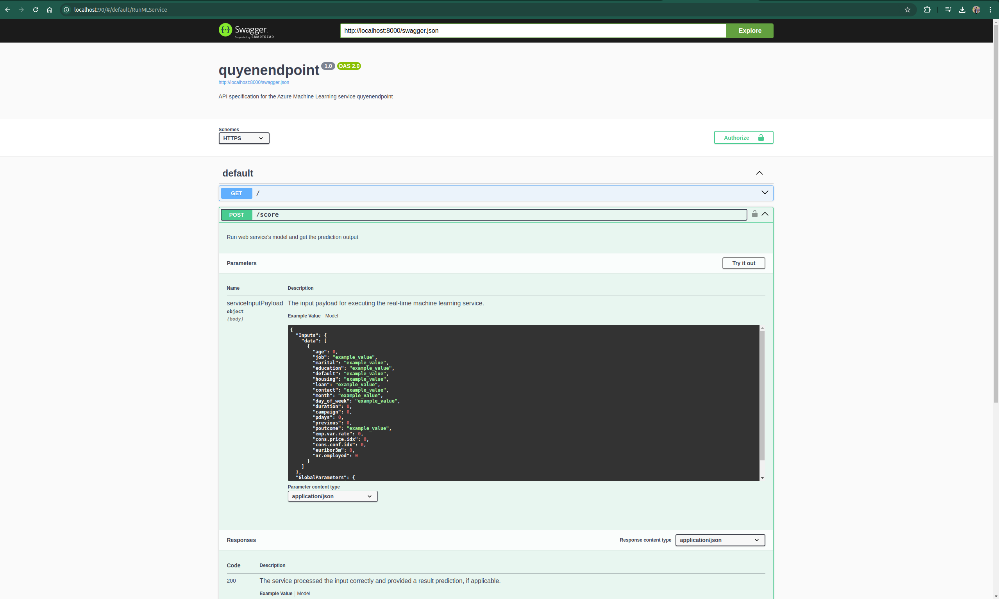
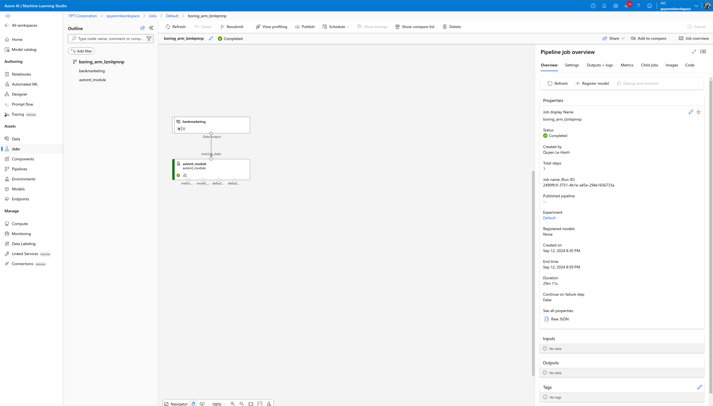

# Operationalizing Machine-Learning in Azure
## Overview
This is an end-to-end machine learning project on Microsoft Azure where we will build a cloud-based machine learning production model, deployed, and consumed it. Using the Bank Marketing Dataset, we will train a machine learning model leveraging the AutoML in Azure Machine Learning Studio, deploy it into production using Azure Container Instance (ACI) and consume it using REST endpoints. We will also create, publish and consume a pipeline to automate the whole process.

## Architectural Diagram

The architectural diagram above shows the flow of operations:
1. __Authenication (optional)__: Install the Azure Machine Learning Extension which allows you to interact with Azure Machine Learning Studio,. After having the Azure machine Learning Extension, you will create a Service Principal account and associate it with your specific workspace.
2. __Register the Dataset__: Upload the dataset into Azure Machine Learning Studio.
3. __AutoML run__: Set up configurations like compute cluster, type of machine learning task, etc. This trains different models on our uploaded dataset.
4. __Deploy the best model__: Select the best performing model from our AutoML run and deploy into production using Azure Container Instance (ACI).
5. __Enable logging and Application Insights__: This can be done either when deploying the model into production from the studio or afterwards using a python script. This helps us keep track of deployed model performance and number of successful/failed requests.
6. __Consume Model Endpoints__: After deploying the model, a REST endpoint is generated and this enables other services to interact with our deployed model. We can send requests to the deployed model  and get responses (predictions).
7. __Create and Publish a Pipeline__: Using the Azure Python SDK in Jupyter Notebook, we can create and publish a pipelinel.

## Key Steps
1. **Authentication**: This was done automatically in the course Workspace.

2. **Automated ML Experiment**: An AutoML run was configured and several models were trained on the Bank Marketing Dataset.
**Registered Dataset**

**Experiment Completed**

**Best Model**

3. **Deploy Best Model and Enable Logging**: The best model from our AutoML run is deployed into production using Azure Container Instance (ACI) and we can access endpoints through which other services can interact with our deployed model. After deploying our best model, we can enable Application Insights and retrieve logs. \
**Model Deployed and Application Insights Enabled**

4. **Swagger Documentation**: Swagger can be used to share documentation among product managers, testers, and developers and can also be used by various tools to automate API-related processes. We consumed our deployed model using swagger and displayed the contents of the API for the model. \
**Swagger Output**

5. **Consume Model Endpoint**: Once the model is deployed, we use the python script `endpoint.py` provided to interact with the trained model and return an output (prediction). \
**logs.py output**

**Endpoint.py output**

6. **Create, Publish, and Consume a Pipeline**: We use the Azure Python SDK with the aid of Jupyter Notebook to create, publish, and consume a pipeline. \
**Created Pipeline**

**BankMarketing AutoML**

**Pipeline Endpoint**

**Running Pipeline**

**Status Active**

**Run Details**

## Screen Recording
https://youtu.be/kUhptwBGhxQ

## Standout Suggestions
 We can benchmark the endpoint created from the deployed model using Apache Benchmark tool. This helps to create a baseline or acceptable performance measure. We can also export the model to support ONNX