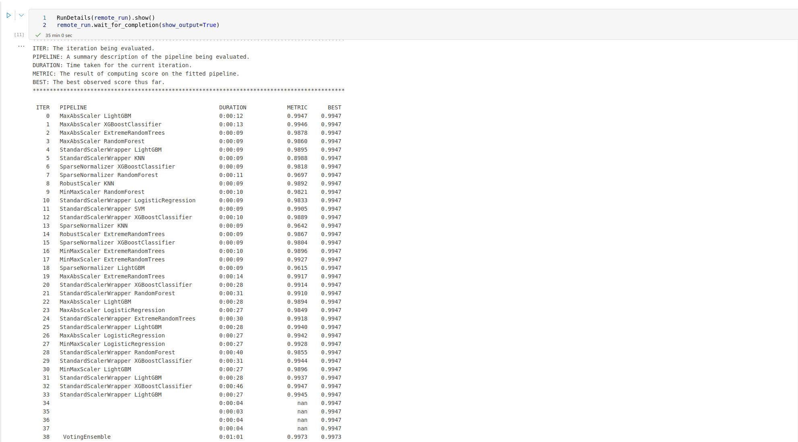
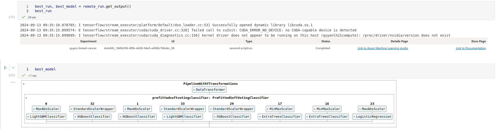
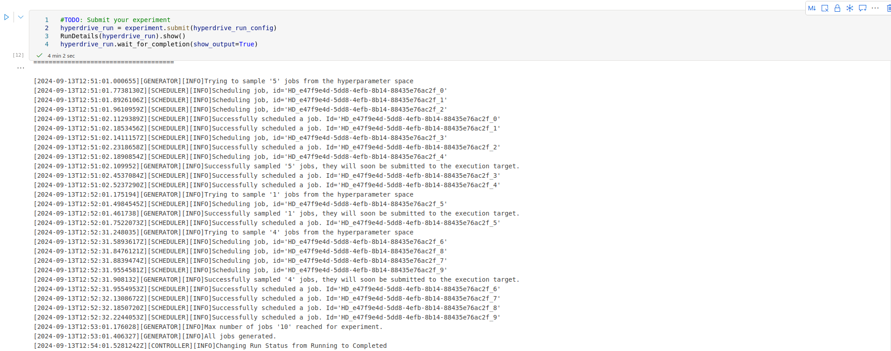
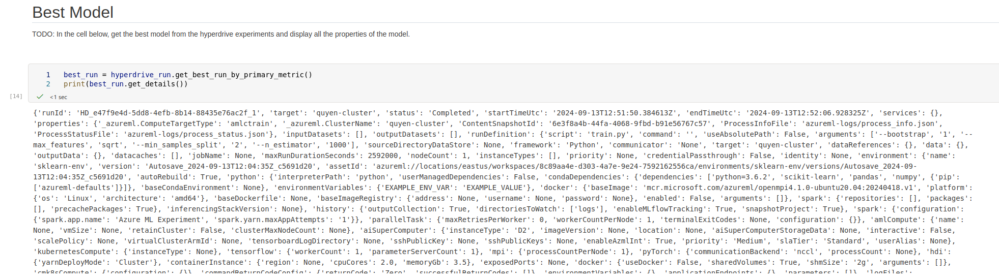

# Machine Learning Engineer with Microsoft Azure - Capstone Project
This is the capstone project of the Machine Learning Engineer with Microsoft Azure Nanodegree Program.

## Dataset
In this project, we will use the Wisconsin Breast Cancer dataset from Kaggle. The data file can be downloaded [here](https://www.kaggle.com/datasets/uciml/breast-cancer-wisconsin-data).

### Overview
The dataset is obtained is the Wisconsin Breast Cancer dataset from Kaggle. The features are computed from a digitized image of a fine needle aspirate (FNA) of a breast mass. The label is Diagnosis (M = malignant, B = benign).  Ten real-valued features are computed for each cell nucleus:
1. radius (mean of distances from center to points on the perimeter)
2. texture (standard deviation of gray-scale values)
3. perimeter
4. area
5. smoothness (local variation in radius lengths)
6. compactness (perimeter^2 / area - 1.0)
7. concavity (severity of concave portions of the contour)
8. concave points (number of concave portions of the contour)
9/ symmetry
10. fractal dimension ("coastline approximation" - 1)

### Task
The dataset provides us with a binary classification task that requires us to classify the the given details of the FNA image into two classes: Malignant and Benign.

### Access
The data file is downloaded from Kaggle: https://www.kaggle.com/datasets/uciml/breast-cancer-wisconsin-data.

## Automated ML
The AutoML Settings are defined as:
1. "experiment_timeout_minutes" = 20: The maximum amount of time in minutes that all iterations combined can take before the experiment terminates.
2. "primary_metric" = 'AUC_weighted': The metrics that Azure AutoML will optimize for model selection.

The configurations for the AutoMLConfig instance are defined as:
1. task = "classification"
2. label_column_name="diagnosis"
3. enable_early_stopping= True

### Results
The AutoML experiment run generated VotingEnsemble algorithm as the best model with accuracy of 0.9806.
__AutoML Run Details__

__AutoML Best Model__

## Hyperparameter Tuning
The model used in this experiment is the RandomForestClassifier from sklearn library.  The required dataset is loaded as a dataframe using pandas library. The dataset is split into test and train with the test set being 30% of the data and at the default random state of 42. The scikit-learn pipeline uses the RandomForestClassifier which requires the following hyperparameters:
1. n_estimators: Number of trees in the forest.
2. min_samples_split: Minimum number of samples required to split an internal node.
3. max_features - {'auto', 'sqrt', 'log2'}: The number of features to consider when looking for the best split:

Random Sampling is chosen as the sampling parameter as it supports both discrete and continuous hyperparameters providing a wider range of possible parameter combinations for the users.

### Results
The Hyperdrive tuned best model generated an accuracy of 0.9707 with the following the configurations:
* No of Estimators: 1000
* Min No of Samples to Split: 2
* No of Features Considered: sqrt
* Bootstrap: True

__HyperDrive Run Details__

__HyperDrive Best Model__

## Model Deployment
The best model is the one from AutoML. Deploying this model will allow us to interact with the HTTP API service by sending data over POST requests.

The `endpoint.py` script can be used to make a POST request for predicting the label of given records. The script contains the data payload that is required to pass through the HTTP request. After the endpoint is deployed, a scoring URI and secret key will be generated.The generated scoring URI and secret key must be added in the endpoint.py script. Then run the endpoint.py script to consume the deployed endpoint.

## Screen Recording
https://youtu.be/JAU1U3DCCkw

## Standout Suggestions
I do not have any.
